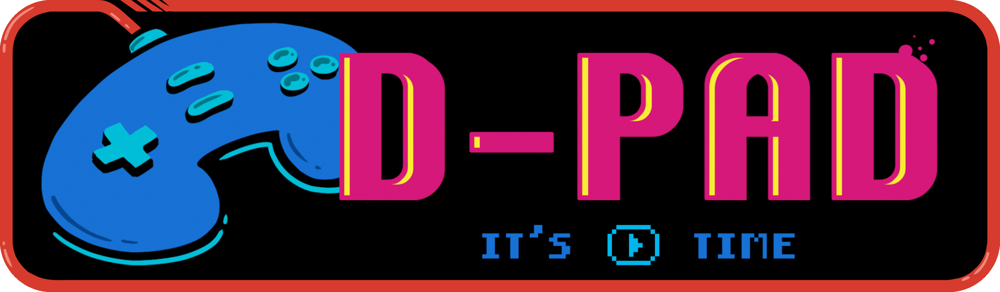

   

<h3 align="center"> 
   The Video-Game Music Player
</h3>

# Description
D-Pad is a responsive jukebox preloaded with a number of classic video-game tunes.

Users can listen to the music-player using play/pause, next, previous and mute buttons as well as volume and song-time sliders.

# Requirements
No special requirements.
- Clone this repository to your desktop
- Navigate to the top level of the directory
- Open index.html in your browser.

# Technologies
- HTML5
- CSS
- JavaScript
- Adobe Photoshop 2022

# Issues & Bugs

## Issues
- A button for randomising the songs would be a nice addition.

## Bugs
- The volume control and mute button don't seem to work when used on a phone.